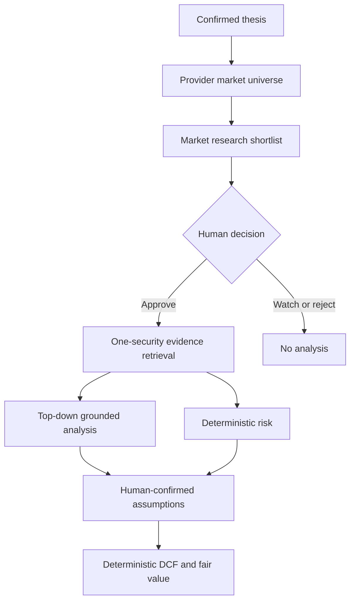

# Thesis-Driven Discovery and Valuation

## Implemented workflow



The pre-existing thesis extraction, portfolio-monitoring analysis, manifest,
PDF, authentication and Railway services remain intact. Opportunity discovery
is a separate state machine so a research candidate is never confused with a
held position.

## Non-negotiable controls

- A discovery result is rejected if its ticker is absent from the
  dashboard-supplied provider universe.
- The market-research model may rank and interpret supplied fields; it cannot
  calculate a new financial metric.
- A candidate receives no financial analysis until the owner explicitly
  approves it.
- Approval creates or links a security reference only. It does not create a
  position, transaction or trade.
- Approved candidates are processed as independent one-security runs.
- Every financial claim must cite an exact supplied grounding key.
- Volatility, drawdown, historical VaR and parametric VaR are computed from the
  provider price series by TypeScript.
- DCF arithmetic is deterministic. The owner must review the method and confirm
  every growth, discount, terminal-growth, net-debt and share-count assumption.
- Standard FCFF DCF is flagged as a method mismatch for financial institutions
  and real-estate vehicles.

## Agent personalization

`/agent-settings` versions four configurations: thesis extraction, market
research, security analysis and portfolio synthesis. Owners can edit the role
name, scope and prompt addendum. Tool access is a whitelist: document,
structured universe and grounding tools are mandatory for their stages; hosted
web search is enabled by default and can be disabled only for market research.

Customization is appended below immutable system policy. It cannot disable
grounding validation, enable LLM arithmetic, grant database access, add trade
execution or bypass human approval.

The market researcher can use the OpenAI Responses API hosted `web_search` tool
when enabled. Candidate identities still must exist in the EODHD structured
universe, and retrieved sources must survive URL validation. OpenAI documents
that web-search output includes source metadata and citation annotations:
<https://developers.openai.com/api/docs/guides/tools-web-search>.

## Market-data setup

Railway needs these project/environment shared secrets:

```text
OPENAI_API_KEY=<secret>
MARKET_DATA_API_KEY=<EODHD token>
```

The dashboard service receives:

```text
MARKET_DATA_PROVIDER=eodhd
MARKET_DATA_API_KEY=${{shared.MARKET_DATA_API_KEY}}
```

The adapter uses EODHD's global Screener for a bounded research universe, then
its Fundamentals and End-of-Day endpoints after human approval. EODHD documents
that screener filters are combined with AND, results are paginated, returned
values use the listing currency, and missing fields can exclude securities:
<https://eodhd.com/financial-apis/stock-market-screener-api>.

## Expected UI sequence

1. Upload and confirm the thesis under **Investment Thesis**.
2. Create Swiss Quality and/or Brazilian Growth portfolios.
3. Configure agent preferences under **Agent Settings**.
4. Open **AI Stock Discovery** and start market research.
5. Review sources, gaps and thesis fit for every shortlisted security.
6. Approve, watchlist or reject each security.
7. Wait for an approved candidate's independent financial analysis.
8. Review standalone risk metrics and their methodology.
9. Open valuation, confirm the source fields and enter judgmental assumptions.
10. Calculate and review the DCF fair-value scenario and sensitivity caveats.

The final result is analytical decision support, not an execution instruction or
professional financial advice.
