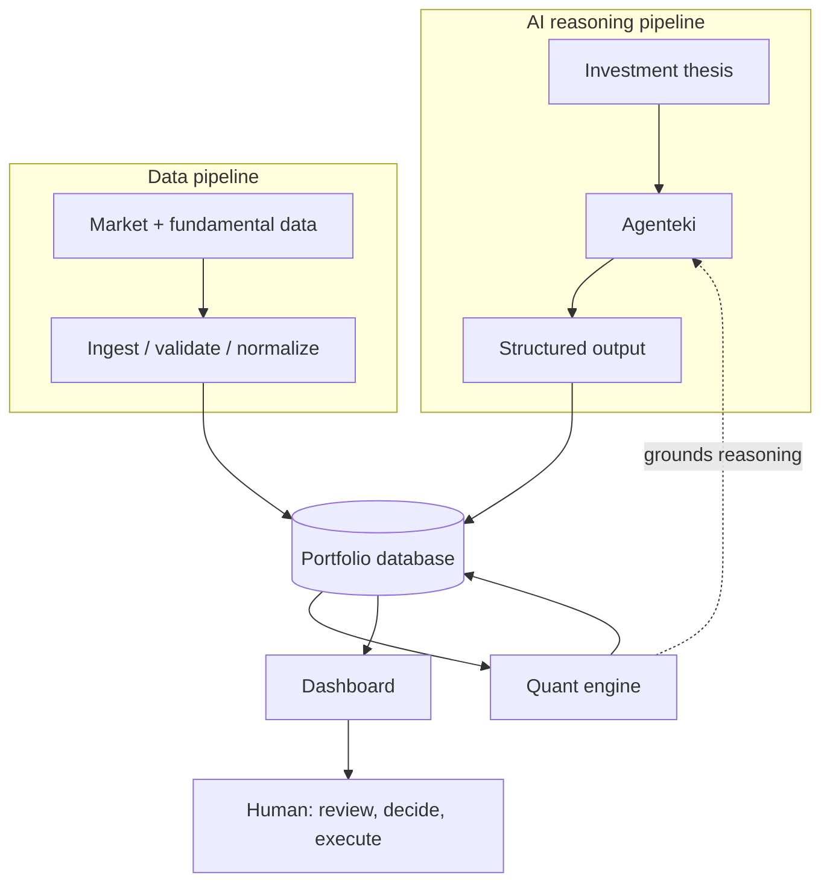
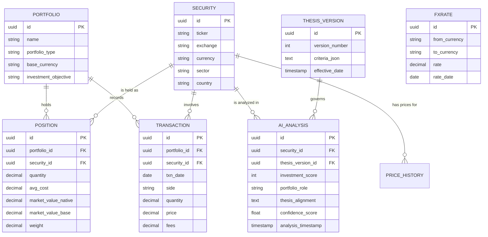

# AI Investment Management & Portfolio Intelligence System
## System Architecture — v0.1 (Draft, awaiting validation)

**Status:** v0.2 — build-vs-buy, currency-reporting, and phasing questions resolved (see Section 10). Not yet implemented.
**Scope:** Personal-use system, single investor, two portfolios (CH equity / BR equity / fixed income & liquidity), built fully custom, reported in native currency per portfolio.

---

## How confident is this document

Not all claims below carry the same weight. Rather than one blanket confidence score, here's the breakdown:

- **High confidence, externally verified this session:** the AI/deterministic-calculation separation is standard practice, not just a good idea (Section 1); QuantStats, Riskfolio-Lib, and fincore are real, maintained libraries (Section 5); Twelve Data and EOD Historical Data both explicitly list SIX Swiss Exchange (XSWX) and B3 (BVMF) as covered exchanges (Section 9); IEX Cloud is dead — shut down August 31, 2024 (Section 9); Ghostfolio ships an MCP server that lets an AI client read portfolio state directly (Section 1, Section 9) — referenced for context even though you've since decided not to build on it.
- **Medium confidence, informed judgment, genuinely arguable:** agent-framework-vs-hand-rolled recommendation (Section 9), the specific technology picks, the Phase 1 internal sequencing in Section 8.
- **Decided, no longer open:** build vs. extend (custom, full scope — Section 10 Q1); currency reporting (native per portfolio, total shown via live display-currency picker, no blending in any calculated metric — Section 10 Q2); phasing (no separate Phase 0, folded into Phase 1's build order — Section 8). All three original blocking questions are now closed; see the decision log for full reasoning.
- **Not verified — verify before you commit money or time:** exact current pricing/rate limits/fundamentals-depth for any specific data vendor tier. Marketing pages confirm exchange coverage; they're less reliable on the fine print.

---

## 1. System Architecture

Your original design — two pipelines converging at the dashboard — is correct and matches how the systems I researched are actually built (see Section 11). I've added one structural element that your spec implies but doesn't state explicitly: **the quant engine's output must be readable by Agenteki, not just writable by Agenteki into the database.**

This matters more than it sounds. Recent work on LLM agents in finance (both academic and industry) converges on the same finding: LLMs are fluent but not arithmetic-competent, and the fix isn't a smarter model, it's an architecture that treats the model's own working memory as disposable and forces every number through a deterministic, queryable store. One academic framework for trading agents calls this a "deterministic state store" that is explicitly **read-only to the LLM** and updated solely by the calculation layer. Ghostfolio, the most mature open-source portfolio tracker, has independently converged on the same pattern: it now ships a Model Context Protocol server specifically so an AI client can query portfolio state rather than reconstruct it. Addepar's "Addison" AI follows the identical principle at the institutional end — grounded in the platform's own clean data model, not the model's training data. Your instinct to keep the AI out of the numbers was right; the missing piece was making that a two-way contract (AI writes interpretation, reads numbers) rather than one-way isolation.



The diagram above this document in our conversation shows the same structure simplified for a quick read; this version has the full labeling.

**What did not change from your spec:** the layer responsibilities (Section 15 of your prompt), the phased approach, the principle that the human executes trades, not the system.

---

## 2. Component Map

| Component | Responsibility | Notes |
|---|---|---|
| Thesis parser | Turns the strategy document into structured, versioned criteria | Needs its own version history — see Section 6 |
| Agenteki orchestrator | Runs the screening → analysis → scoring pipeline | See Section 9 on framework vs. hand-rolled |
| Data connectors | One adapter per vendor (prices, fundamentals, FX) | Must be swappable — see the IEX Cloud case study in Section 9 |
| Validation & normalization service | Currency tagging, stale-data detection, unit consistency | This is where "silently mixing stale and current data" gets prevented |
| Portfolio database | Single source of truth for state | PostgreSQL — see Section 6 |
| Quant engine | All calculations: weights, returns, risk | Built on existing libraries, not from scratch — see Section 5 |
| FX / currency layer | Base-currency conversion, native vs. base-currency returns | **Not in your original spec — added, see below** |
| API layer | Serves dashboard and (later) Agenteki's read access to computed metrics | FastAPI or equivalent |
| Dashboard frontend | Visualization and decision support | See Section 7 |
| Alert engine | Portfolio, market, and thesis alerts | Phase 3 per your own sequencing |
| Scheduler | Periodic data refresh, periodic re-analysis | Cron is enough at this scale; no need for Airflow |
| Decision log | Append-only record of architectural and investment decisions | See the companion file `decision-log.md` |

### The component your spec is missing: FX / currency layer

Your thesis is explicitly bi-national — Swiss quality equities and Brazilian growth equities, each in its own currency, held for capital preservation and appreciation respectively. Sections 10–12 of your prompt (Performance Engine, Risk Engine) never mention currency conversion, a base currency, or FX exposure as a tracked risk. That's a real gap, not a nitpick: the Brazilian real has historically been a volatile currency against CHF, USD, and EUR alike, so a large share of the reported return and reported volatility of your "Brazilian Growth" sleeve will actually be FX-driven, independent of whether the underlying businesses are performing. Sharpe ratio, correlation, and VaR all give different — sometimes very different — answers depending on whether they're computed in native currency or base currency. Ghostfolio and Kubera both treat multi-currency handling as core infrastructure, not an add-on (Kubera's founders describe it as a problem they'd personally lived through managing wealth across countries). I'd add this as a required component: an FX rate time series, a declared base currency, and a native-vs-base-currency toggle on every return and risk figure.

---

## 3. Data Flow

**AI pipeline:** Investment thesis → Agenteki (screen → fundamental analysis → thesis alignment → risk flagging → portfolio role → score) → structured output conforming to the schema in the Appendix → database.

**Data pipeline:** External sources → ingestion → validation (currency tagged, staleness checked, source recorded) → normalization → database → quant engine (weights, returns, volatility, Sharpe, VaR, FX-adjusted figures) → database (computed values written back, tagged with methodology).

**Convergence:** Both pipelines write to the same database. The quant engine's computed values are then available for Agenteki to read on its next run — this is the grounding loop from Section 1. The dashboard reads from the database (raw + computed + AI-generated), never recalculates anything itself, and never lets the AI's prose override a calculated number.

---

## 4. Agenteki — Responsibilities

**Should:**
- Interpret the thesis document into explicit, versioned criteria
- Screen, compare, classify, explain
- Read (not write) quant-engine outputs as grounding for its reasoning
- Produce structured output conforming to the schema, every time, not prose-only
- Flag qualitative risks and missing information explicitly
- State its own confidence and cite what specific retrieved/calculated data point each claim rests on
- Version its own conclusions so a changed recommendation is visible as a diff, not a silent overwrite

**Should not:**
- Calculate weights, returns, volatility, Sharpe, VaR, or any other quantitative metric — ever, not even as a sanity check, not even "just this once"
- Blend data of different timestamps without flagging it
- Execute trades or place orders
- Present a hypothesis as a verified fact
- Silently revise a prior conclusion without a visible delta against the previous version

The load-bearing research point here: one industry write-up on LLM financial analysis notes that a general-purpose model answering finance questions with retrieval alone showed an error/refusal rate as high as 81% in at least one published evaluation — a striking number I'd treat with normal skepticism about any single benchmark, but directionally consistent with everything else found this session. The fix in every credible source is architectural (separate the arithmetic from the language model), not "use a smarter model."

---

## 5. Quant Engine — Responsibilities

Full calculation list, matching your Section 11 with FX added:

Weights (position, sector, country, portfolio-role) · returns (absolute, TWR, MWR, daily/monthly/annual) · volatility · Sharpe ratio (with documented risk-free rate source, return frequency, annualization, lookback) · drawdown and max drawdown · VaR (historical, parametric, Monte Carlo — each labeled with methodology, confidence level, horizon, lookback) · correlation and covariance · **FX exposure and base-currency-adjusted returns**.

**Do not build this from scratch.** Three actively maintained Python libraries already do most of it:

- **QuantStats** — Sharpe, Sortino, drawdown, volatility, Monte Carlo simulation, and generates an HTML tearsheet that is itself a working answer to your Section 12 explainability requirement.
- **Riskfolio-Lib** — portfolio optimization and 26 convex risk measures including CVaR and max drawdown, Black-Litterman, risk parity. Actively maintained, built on cvxpy.
- **fincore** (successor to empyrical/pyfolio, which are now deprecated) — 150+ metrics plus attribution, if you want a broader baseline than QuantStats alone.

Writing your own Sharpe ratio implementation is a fine learning exercise; it is not a good use of engineering time for a production system when maintained, tested libraries already exist. Use them, and spend the saved time on the FX layer and the data validation logic instead — those are the genuinely custom parts.

**A methodology caution your own spec already half-anticipates (Section 12), worth stating explicitly:** VaR and parametric risk measures were built for large, diversified, liquid institutional books with long clean return histories. A concentrated personal portfolio of perhaps 10–30 thesis-driven positions will often violate the normality assumptions parametric VaR depends on, and a newly-opened position simply doesn't have the lookback history historical VaR needs to mean much. This isn't a reason to skip VaR — it's a reason your dashboard's explainability drill-down (Section 12 of your spec) needs to be genuinely used, not decorative, because on a portfolio this size VaR can look more precise than it is.

---

## 6. Database Model

Your entities (Portfolio, Security, Position, Transaction, AI Analysis) are right. Additions: `FXRate` (time series, from/to currency, date, source), `ThesisVersion` (so every AI Analysis references *which version* of your thesis it was scored against — critical once the thesis itself evolves), `Alert`, `DecisionLogEntry`.



---

## 7. Dashboard — Information Architecture

Pages, mapped to your "five questions" (Section 19 of your prompt), which is genuinely the right frame — Kubera's whole design philosophy converges on the same idea (clean overview, drill-down on demand, nothing decorative):

1. **Overview** — daily P&L, exposure by asset class/role, headline risk (VaR, Sharpe, max drawdown) — each computed and shown in that portfolio's native currency (CHF for Swiss, BRL for Brazilian), no automatic blending. A single "total value" figure is kept, converted live via a currency picker (start with CHF/BRL) — display-only, backed by a daily FX rate, never feeding into any calculated metric. See decision log ADR-002 for the full resolution.
2. **Allocation** — asset class, country, sector, position weight, portfolio-role weight.
3. **Positions** — the table, with AI score and thesis alignment as columns, not a separate silo.
4. **Security detail** — market data, fundamentals, position, risk contribution, full AI analysis, all on one page (your "Portfolio → Position → Security → AI Thesis" flow, Section 14).
5. **AI intelligence feed** — new candidates, changed recommendations, thesis violations.
6. **Risk detail** — the explainability drill-down from Section 12: click any risk number, see the methodology.
7. **Decision log** — the append-only record.

Every number on every page traces back to the database, never to the AI's prose, per Section 15.

---

## 8. MVP Definition

Your original phasing (Section 20) stands as specced — one phase, no Phase 0 detour, per your decision. Phase 1 still bundles Agenteki + structured output + database + dashboard + weights + performance, all in one phase; the risk that raises (a wrong number could be sitting in the data model, the calculation, or the AI's interpretation of both, with no way to tell which) doesn't go away just because there's no separate phase for it, so it's handled as an internal build order instead:

**Phase 1, build order:**
1. Database schema + manual/CSV position entry, no calculations yet.
2. Quant engine: weights and simple returns, checked by hand against a broker statement or a known-correct spreadsheet before anything else gets built on top.
3. Full performance and risk calculations (TWR/MWR, Sharpe, drawdown) on the now-validated foundation.
4. Agenteki: thesis parsing, screening, structured output, writing to the same database.
5. Dashboard, reading from the now-validated, now-populated database.

Same debugging guarantee as a separate Phase 0 (you know the numbers are right before the AI or the UI can obscure where a bug lives) without a phase boundary in the way. See the decision log, ADR-007.

**Phases 2–4:** unchanged from your spec — reliable market data → risk dashboard, then thesis monitoring and alerts, then multi-portfolio and optimization.

---

## 9. Technology Options

**Required**
| Choice | Why |
|---|---|
| Python (backend + quant) | The entire ecosystem you need — pandas, QuantStats, Riskfolio-Lib, data vendor SDKs — is Python-native |
| PostgreSQL | Handles both relational portfolio state and time-series price/FX data well enough at this scale; TimescaleDB extension available if the time-series volume grows |
| A market data vendor with confirmed SIX + B3 coverage | Non-negotiable given your thesis — see below |

**Recommended**
| Choice | Why |
|---|---|
| FastAPI | Thin, typed, well-documented; no reason to reach for more at single-user scale |
| QuantStats + Riskfolio-Lib | See Section 5 |
| Hand-rolled orchestration for Agenteki over a heavy agent framework | Your own diagram (Section 4 of your prompt) describes a fixed pipeline — screen → analyze → align → score — not a system that needs dynamic branching or multi-agent negotiation. LangGraph, CrewAI, AutoGen etc. earn their overhead when the workflow is genuinely non-linear; a fixed DAG is more debuggable as plain functions calling the Anthropic API with structured tool-use output at each stage. Reconsider this if Agenteki's behavior grows real branching logic later. |
| Self-hosting over cloud SaaS | This is personal financial data; Ghostfolio's own self-hosting guidance is worth taking seriously here — a small VPS (their own documentation cites roughly $5/month) handles a personal-scale system comfortably |

**Optional / later**
| Choice | Why |
|---|---|
| Fiscal.ai (already in your connected tools) as a fundamentals source for Agenteki | Institutional-grade data (S&P Market Intelligence-backed), 100,000+ companies, native MCP access, already connected in your environment. Coverage of SIX/B3-listed names specifically is not confirmed — verify directly before relying on it. |
| React + Recharts/Plotly | Once step 5 of Phase 1 (Section 8) is reached and you want the "professional workstation" feel from Section 19, rather than a bare-bones view for steps 1–3 |

*Ghostfolio and Portfolio Performance dropped from this table — Section 10 Q1 resolved in favor of a fully custom build. Kept as reference points in Section 11 since the research findings about their patterns (multi-currency handling, MCP exposure) still informed decisions made elsewhere.*

**On market data — the concrete, checkable finding:** IEX Cloud, a popular affordable choice a couple of years ago, no longer exists — IEX Group shut it down entirely on August 31, 2024 after it became unprofitable at under 2% of the parent company's revenue. That's not a reason to avoid affordable vendors; it's a reason to keep the data-provider layer abstracted behind an interface (which your own Section 15/16 already implies) so a vendor's death is a config change, not a rewrite. Of the vendors checked this session, both Twelve Data and EOD Historical Data explicitly list SIX Swiss Exchange (MIC: XSWX) and B3/Bovespa (MIC: BVMF) as covered exchanges with EOD pricing; Financial Modeling Prep claims broad multi-exchange coverage without naming these two specifically in what I found. Fundamentals depth (not just price coverage) for SIX- and B3-listed names specifically needs a direct check against each vendor's symbol list before you commit — marketing pages are reliable about *which exchanges exist in the platform* and much less reliable about *depth of fundamentals for any one exchange*.

---

## 10. Critical Questions

These are the decisions that materially change the architecture — everything else can be adjusted later without rework.

**1. Build vs. extend an existing tool — RESOLVED.** Full custom build, no Ghostfolio or Portfolio Performance as substrate. See decision log ADR-004 for the trade-off you accepted (you now own the transaction ledger, currency conversion, and TWR/MWR calculation as build scope).

**2. Consolidated vs. per-currency, per-portfolio risk and performance reporting — RESOLVED.** Native currency per portfolio, no blending, for every calculated metric (Sharpe, VaR, correlation, returns). The Overview page keeps a total-value figure, but as a live, user-selectable currency conversion for display only — never touching the underlying metrics. See decision log ADR-002.

**3. Data vendor selection.** Twelve Data and EODHD are the two candidates with confirmed SIX + B3 exchange listings from this session's research; both need a direct check of their fundamentals depth and current pricing for your specific tickers before committing.

**4. Agent orchestration approach.** Hand-rolled pipeline (recommended above) vs. a framework — matters for how much infrastructure code you write before Agenteki does anything useful.

**5. Hosting and security posture.** Self-hosted VPS vs. cloud, and how API keys / any future brokerage credentials get stored — worth deciding deliberately rather than defaulting.

---

## 11. What the research actually validated vs. changed

**Validated as-is:** the three-layer separation (Section 2 of your prompt); AI-interprets/software-calculates (Principle 1); the requirement that every risk metric disclose its methodology (Section 12); human-in-the-loop, no autonomous execution (Section 18) — this last one is validated for a different reason than you may have intended it: U.S. robo-advisor case law shows that automated *and* autonomous-execution advice-for-compensation triggers Investment Advisers Act registration and fiduciary duties regardless of how the advice is generated. That's irrelevant to you managing your own money, but it becomes directly relevant the moment your own Phase 4 ("Multi-Portfolio, Multi-User") lets this system advise anyone but you.

**Added:** the FX/currency layer, scoped down to native-currency-only reporting per your decision (Section 2, Section 10 Q2); the quant-engine-to-Agenteki read path (Section 1); a validated internal build order within Phase 1, replacing the originally-proposed separate Phase 0 (Section 8).

**Resolved this session:** build vs. buy (custom, Section 10 Q1); currency reporting scope (native, Section 10 Q2); phasing (single phase, ordered build, Section 8). Full reasoning for each in the decision log.

**Sources referenced:** Ghostfolio, Portfolio Performance, Addepar, Kubera — for architecture and dashboard-design patterns. Twelve Data, EOD Historical Data, Financial Modeling Prep, Fiscal.ai — for market/fundamental data coverage. QuantStats, Riskfolio-Lib, fincore — for the quant engine. Academic and industry sources on LLM grounding in finance (2025–2026) — for the AI/calculation separation principle.

---

## Appendix: Structured AI-analysis output schema (draft)

```json
{
  "security_id": "uuid",
  "ticker": "string",
  "company_name": "string",
  "country": "string",
  "exchange": "string",
  "currency": "string",
  "sector": "string",
  "industry": "string",
  "thesis_version_id": "uuid",
  "portfolio_candidate": "boolean",
  "portfolio_role": "swiss_quality | brazilian_growth | fixed_income | not_suitable",
  "investment_score": "int 0-100",
  "thesis_alignment_score": "int 0-100",
  "quality_score": "int 0-100",
  "growth_score": "int 0-100",
  "risk_score": "int 0-100",
  "dividend_score": "int 0-100",
  "fundamental_summary": "text",
  "investment_thesis": "text",
  "key_catalysts": ["string"],
  "key_risks": ["string"],
  "thesis_breakers": ["string"],
  "confidence_score": "float 0-1",
  "grounded_in": ["reference to specific quant-engine values used, by metric name and timestamp"],
  "analysis_timestamp": "datetime",
  "data_timestamp": "datetime",
  "agent_version": "string"
}
```

The `grounded_in` field is the one addition to your original schema (Section 6 of your prompt) — an explicit, checkable pointer from every AI conclusion back to the deterministic values it used, so a human reviewer (or a future audit) can see exactly which quant-engine outputs a given score actually rested on.
